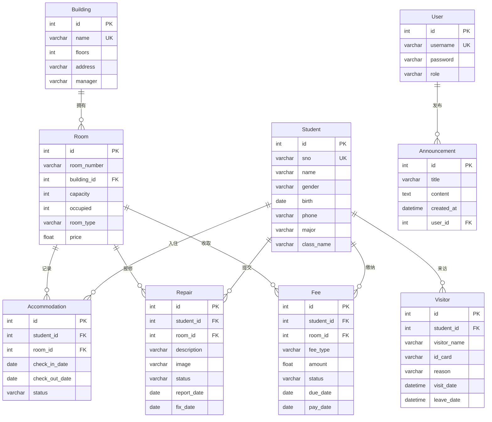

# 学生公寓管理系统 — 需求分析

## 1. 系统目标

构建一个 B/S 架构的学生公寓管理系统，为**学生**和**管理人员**提供公寓日常事务的信息化处理平台，替代传统纸质登记和人工管理方式。

## 2. 用户角色

| 角色 | 身份 | 权限范围 |
|---|---|---|
| **学生（student）** | 住宿学生 | 个人首页、我的住宿（含室友）、提交/撤销报修、查看费用、登记访客、修改个人信息 |
| **宿管员（dorm_manager）** | 宿舍楼管理人员 | 报修处理、访客管理、费用管理、入住管理、公告发布/管理 |
| **系统管理员（admin）** | 公寓管理中心 | 全部功能：宿舍楼/房间管理、学生档案管理、用户管理、公告管理 |

## 3. 功能需求

### 3.1 学生端

| 模块 | 功能 | 描述 |
|---|---|---|
| 个人首页 | 个人仪表盘 | 我的住宿信息（含室友）、待缴费用提醒、报修进度一览、最新公告 |
| 我的住宿 | 查看住宿 | 当前入住的宿舍楼/房间号、入住日期、同房间室友列表（姓名+学号） |
| 报修申请 | 提交报修 | 选择房间、描述问题、上传现场照片/视频 |
| | 报修进度 | 查看自己提交的报修记录及处理状态 |
| | 撤销报修 | 仅允许撤销"待处理"状态的报修申请 |
| 我的费用 | 费用明细 | 查看住宿费、水电费、维修费等各项费用及缴纳状态 |
| 访客登记 | 登记访客 | 填写访客姓名、身份证号、来访事由、来访/离开时间 |
| | 访客记录 | 查看自己的访客登记历史 |
| 个人资料 | 修改信息 | 更新手机号等个人联系方式（学号/姓名/专业等不可自行修改） |

### 3.2 宿管员端

| 模块 | 功能 | 描述 |
|---|---|---|
| 工作台 | 概览面板 | 管辖范围内的入住统计、待处理报修数、未缴费统计 |
| 报修处理 | 查看报修 | 查看所有报修记录（含现场照片） |
| | 更新状态 | 状态流转：待处理 → 处理中 → 已完成 |
| 访客管理 | 查看/登记 | 查看所有访客记录，协助学生登记访客 |
| 费用管理 | 费用录入 | 为学生录入住宿费、水电费、维修费等 |
| | 缴费确认 | 线下收款后，在系统内确认缴费，更新费用状态 |
| 入住管理 | 入住登记 | 为学生分配房间（需校验房间容量） |
| | 退宿办理 | 办理退宿，更新房间已住人数 |
| 公告管理 | 发布公告 | 发布/编辑/删除公告（停水停电、缴费提醒等） |

### 3.3 系统管理员端

| 模块 | 功能 | 描述 |
|---|---|---|
| 仪表盘 | 全局统计 | 宿舍楼数、房间总数、入住人数、待处理报修数、未缴费统计、最近报修 |
| 宿舍楼管理 | 增删改查 | 管理宿舍楼信息（名称、楼层数、地址、楼管） |
| 房间管理 | 增删改查 | 按宿舍楼管理房间（房号、类型、容量、价格） |
| 学生管理 | 增删改查 | 学生档案（学号、姓名、性别、专业、班级、联系方式） |
| 用户管理 | 账号管理 | 创建/禁用学生和宿管员账号 |
| 公告管理 | 发布公告 | 发布/编辑/删除公告（同宿管员权限） |

## 4. 业务规则

1. **入住规则**：一名学生只能有一间"入住中"的房间；房间已住人数不能超过容量
2. **退宿规则**：退宿时自动将房间已住人数 -1，记录标记为"已退宿"
3. **报修流转**：待处理 → 处理中 → 已完成，完成时记录修复日期
4. **报修撤销**：仅"待处理"状态的报修可撤销；"处理中"和"已完成"不可撤销
5. **费用规则**：费用线下缴纳，管理员在系统内确认；状态从"未缴"变为"已缴"，记录实缴日期
6. **级联删除**：删除宿舍楼时，其下所有房间及相关记录一并删除
7. **访客登记**：需记录身份证号和来访/离开时间
8. **个人信息**：学生可修改手机号等联系方式，学号、姓名、专业等不可自行修改
9. **公告发布**：管理员和宿管员可发布/编辑/删除公告，学生仅可查看

## 5. 数据需求（9 个实体）

### 5.1 ER 图



### 5.2 实体与关系说明

| 实体 | 核心属性 | 关系 |
|---|---|---|
| 宿舍楼（Building） | id, name(UK), floors, address, manager | 1 : N 房间（级联删除） |
| 房间（Room） | id, room_number, building_id(FK), capacity, occupied, room_type, price | N : 1 宿舍楼；1 : N 入住/报修/费用 |
| 学生（Student） | id, sno(UK), name, gender, birth, phone, major, class_name | 1 : N 入住/报修/访客/费用 |
| 入住记录（Accommodation） | id, student_id(FK), room_id(FK), check_in_date, check_out_date, status | N : 1 学生；N : 1 房间 |
| 报修记录（Repair） | id, student_id(FK), room_id(FK), description, image, status, report_date, fix_date | N : 1 学生；N : 1 房间 |
| 访客记录（Visitor） | id, student_id(FK), visitor_name, id_card, reason, visit_date, leave_date | N : 1 学生 |
| 费用记录（Fee） | id, student_id(FK), room_id(FK), fee_type, amount, status, due_date, pay_date | N : 1 学生；N : 1 房间 |
| 用户（User） | id, username(UK), password, role | 1 : N 公告 |
| **公告（Announcement）** | **id, title, content, created_at, user_id(FK)** | **N : 1 用户** |

> 新增实体以粗体标注；UK = 唯一约束，FK = 外键。

### 5.3 关系基数

```
Building (1) ──── (N) Room         每个宿舍楼有多间房，房间属于一个楼
Room     (1) ──── (N) Accommodation 每间房可有多条入住记录
Room     (1) ──── (N) Repair        每间房可有多条报修
Room     (1) ──── (N) Fee           每间房可有多条费用
Student  (1) ──── (N) Accommodation 每个学生可有多条入住记录（历史）
Student  (1) ──── (N) Repair        每个学生可提交多次报修
Student  (1) ──── (N) Visitor       每个学生可登记多位访客
Student  (1) ──── (N) Fee           每个学生可有多笔费用
User     (1) ──── (N) Announcement  每个用户可发布多条公告
```

