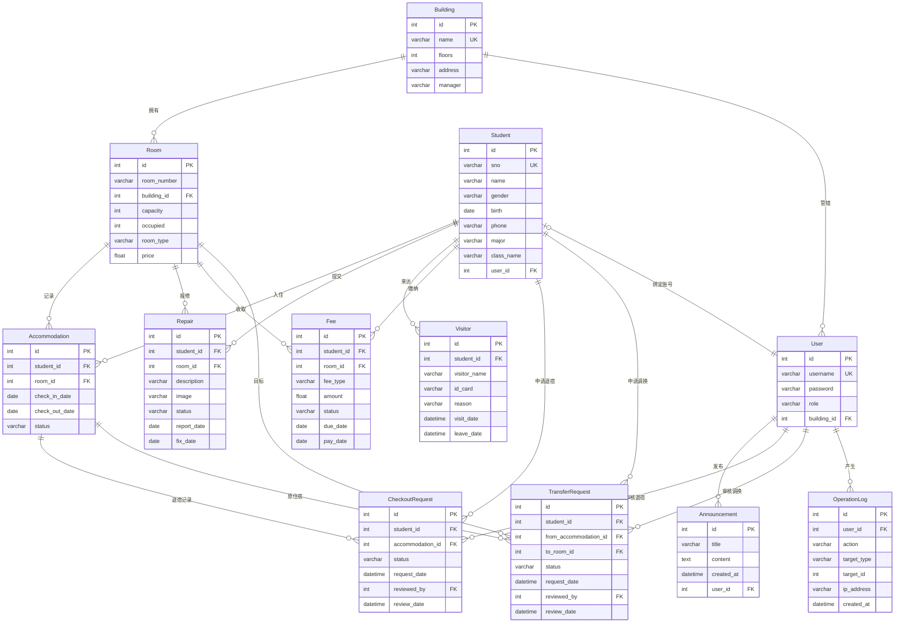

# 学生公寓管理系统 — 需求分析

## 1. 系统目标

构建一个 B/S 架构的学生公寓管理系统，为**学生**和**管理人员**提供公寓日常事务的信息化处理平台，替代传统纸质登记和人工管理方式。系统采用 Flask + MySQL 实现，包含 12 张数据表、3 个存储过程、1 个函数和 2 个触发器。

## 2. 用户角色

| 角色 | 身份 | 权限范围 |
|---|---|---|
| **学生（student）** | 住宿学生 | 个人首页（住宿+室友+费用+报修概览）、申请退宿/调换、提交报修（含照片/视频）、撤销报修、查看费用、登记访客、修改个人信息、修改密码 |
| **宿管员（dorm_manager）** | 宿舍楼管理人员 | 学生全部权限 + 管辖楼范围内：退宿审核、调换审核、报修处理、访客管理、费用管理（含批量生成）、入住管理、公告管理 |
| **系统管理员（admin）** | 公寓管理中心 | 全部功能：宿舍楼/房间/学生 CRUD、用户管理、批量导入学生、操作日志审计、Excel 导出、公告管理 |

### 2.1 宿管员管辖范围（building scope）

宿管员通过 `User.building_id` 绑定管辖宿舍楼，所有数据操作自动限定在该楼范围内：入住/退宿审核/调换审核/报修/费用列表仅显示管辖楼数据，表单下拉仅可选管辖楼房间。admin 无此限制，可查看全部数据。

## 3. 功能需求

### 3.1 学生端

| 模块 | 功能 | 描述 |
|---|---|---|
| 个人首页 | 仪表盘 | 我的住宿信息（含室友列表）、待缴费用提醒、报修进度一览、最新公告 |
| 我的住宿 | 查看住宿 | 当前入住的宿舍楼/房间号、入住日期、同房间室友列表（姓名+学号） |
| | 申请退宿 | 提交退宿申请，等待宿管员审核（不可重复申请） |
| | 申请调换 | 选择同楼空房间申请调换，等待宿管员审核（不可重复申请） |
| 报修申请 | 提交报修 | 选择房间、描述问题、上传现场照片/视频（png/jpg/mp4 等） |
| | 报修进度 | 查看自己提交的报修记录及处理状态（待处理/处理中/已完成/已撤销） |
| | 撤销报修 | 仅允许撤销"待处理"状态的报修 |
| 我的费用 | 费用明细 | 查看住宿费、水电费、维修费等各项费用及缴纳状态 |
| 访客登记 | 登记访客 | 填写访客姓名、身份证号（18位校验）、来访事由、来访/离开时间 |
| | 访客记录 | 查看自己的访客登记历史 |
| 个人资料 | 修改信息 | 更新手机号等联系方式（学号/姓名/专业等不可自行修改） |
| 修改密码 | 密码安全 | 验证原密码后修改新密码（scrypt 哈希存储） |

### 3.2 宿管员端

| 模块 | 功能 | 描述 |
|---|---|---|
| 工作台 | 概览面板 | 管辖楼入住统计、各楼入住率（MySQL 函数实时计算）、待处理报修数、未缴费统计、最近报修 |
| 退宿审核 | 审核列表 | 查看学生退宿申请（pending 优先），批准后自动更新 accommodation + 触发器扣减 room.occupied；拒绝后申请关闭 |
| 调换审核 | 审核列表 | 查看学生调换申请（pending 优先），批准后调用 `sp_room_transfer` 原子迁移住宿记录并同步更新两间房 occupied |
| 报修处理 | 查看报修 | 查看管辖楼所有报修记录（含现场照片/视频缩略图） |
| | 更新状态 | 状态流转：待处理 → 处理中 → 已完成（触发器自动 set fix_date） |
| 访客管理 | 查看/登记 | 查看管辖楼所有访客记录，协助学生登记访客 |
| 费用管理 | 费用录入 | 为学生录入住宿费、水电费、维修费等 |
| | 缴费确认 | 线下收款后在系统内确认缴费，状态变为"已缴"并记录实缴日期 |
| | 批量生成 | 调用 `sp_generate_fees` 为整栋楼在住学生批量生成费用 |
| 入住管理 | 入住登记 | 调用 `sp_checkin` 原子操作：校验是否已入住 → 锁行检查容量 → INSERT + UPDATE occupied |
| | 退宿办理 | 直接办理退宿，更新房间人数（触发器自动扣减） |
| 公告管理 | 发布公告 | 发布/编辑/删除公告（停水停电、缴费提醒等），仅限管辖楼可见场景 |
| Excel 导出 | 数据导出 | 入住/退宿审核/调换审核/报修/费用/访客列表均支持导出 .xlsx |

### 3.3 系统管理员端

| 模块 | 功能 | 描述 |
|---|---|---|
| 仪表盘 | 全局统计 | 宿舍楼数、房间总数、入住人数、待处理报修数、未缴费统计、各楼入住率（调用 `fn_occupancy_rate`）、最近报修 |
| 宿舍楼管理 | 增删改查 | 管理宿舍楼信息（名称、层数、地址、管理员），级联删除关联房间 |
| 房间管理 | 增删改查 | 按宿舍楼筛选管理房间（房号、类型、容量、已住、价格），唯一约束(building_id, room_number) |
| 学生管理 | 增删改查 | 学生档案（学号、姓名、性别、专业、班级、手机），支持搜索/分页 |
| | 批量导入 | 上传 Excel(.xlsx/.xls) 批量导入，自动映射中文表头，校验重复学号 |
| 用户管理 | 账号管理 | 创建/编辑/删除用户（admin/dorm_manager/student），宿管员需绑定管辖楼 |
| 公告管理 | 发布公告 | 发布/编辑/删除公告（同宿管员） |
| 操作日志 | 审计查看 | 查看所有敏感操作记录（操作人、时间、IP、操作内容），支持搜索/分页 |
| Excel 导出 | 全部导出 | 所有 10 个列表页（宿舍楼/房间/学生/入住/退宿审核/调换审核/报修/费用/访客/用户/公告/日志）均支持导出 |

## 4. 业务规则

1. **入住规则**：一名学生只能有一间"入住中"的房间；房间已住人数不能超过容量。通过 `sp_checkin` 存储过程原子执行：检查重复 → `FOR UPDATE` 锁行 → 容量校验 → INSERT + UPDATE occupied
2. **退宿流程**：学生端提交申请 → `CheckoutRequest`(pending) → 宿管员审核（批准/拒绝）。批准后自动更新 accommodation status + `trg_accommodation_checkout` 触发器扣减 room.occupied；拒绝则关闭申请。学生不可重复申请
3. **调换流程**：学生端选择同楼空房间申请 → `TransferRequest`(pending) → 宿管员审核（批准/拒绝）。批准后调用 `sp_room_transfer` 原子操作：锁两间房 → 容量校验 → UPDATE accommodation + 两间房 occupied。学生不可重复申请
4. **报修流转**：待处理 → 处理中 → 已完成（`trg_repair_complete` 触发器自动记录 fix_date）。学生可撤销"待处理"状态的报修（状态变为"已撤销"）
5. **报修文件**：支持上传现场照片（png/jpg/gif/bmp/webp）和视频（mp4/webm/avi/mov），UUID 重命名存储。列表页图片缩略图点击放大，视频内嵌播放器
6. **费用规则**：费用线下缴纳，管理员在系统内确认；状态从"未缴"变为"已缴"，记录实缴日期。支持 `sp_generate_fees` 为整栋楼在住学生批量生成费用
7. **级联删除**：删除宿舍楼时，其下所有房间及相关记录级联删除（ORM cascade="all, delete-orphan"）
8. **访客登记**：需记录身份证号（18位格式校验）和来访/离开时间
9. **个人信息**：学生可修改手机号等联系方式，学号、姓名、专业等不可自行修改
10. **Excel 导入导出**：学生支持批量导入（自动映射中文表头、重复校验、逐行错误收集）；所有 10 个列表页支持导出 .xlsx（保留当前搜索/筛选条件）
11. **操作日志**：所有增删改操作自动记录操作人、时间、IP，独立事务写入，admin 可查看/搜索
12. **密码安全**：werkzeug scrypt 哈希存储，256 字符列，修改密码需验证原密码

## 5. 数据需求（12 个实体）

### 5.1 ER 图



### 5.2 实体与关系说明

| 实体 | 核心属性 | 关系 |
|---|---|---|
| 宿舍楼（Building） | id, name(UK), floors, address, manager | 1 : N 房间（级联删除）；1 : N 用户（宿管员管辖） |
| 房间（Room） | id, room_number, building_id(FK), capacity, occupied, room_type, price | N : 1 宿舍楼；1 : N 入住/报修/费用/调换申请(目标) |
| 学生（Student） | id, sno(UK), name, gender, birth, phone, major, class_name, user_id(FK,UK,可空) | 1 : N 入住/报修/访客/费用/退宿申请/调换申请；1 : 1 用户（可选绑定） |
| 入住记录（Accommodation） | id, student_id(FK), room_id(FK), check_in_date, check_out_date, status | N : 1 学生；N : 1 房间；1 : N 退宿申请/调换申请 |
| 报修记录（Repair） | id, student_id(FK), room_id(FK), description, image, status, report_date, fix_date | N : 1 学生；N : 1 房间 |
| 访客记录（Visitor） | id, student_id(FK), visitor_name, id_card, reason, visit_date, leave_date | N : 1 学生 |
| 费用记录（Fee） | id, student_id(FK), room_id(FK), fee_type, amount, status, due_date, pay_date | N : 1 学生；N : 1 房间 |
| **退宿申请（CheckoutRequest）** | **id, student_id(FK), accommodation_id(FK), status, request_date, reviewed_by(FK), review_date** | **N : 1 学生；N : 1 入住记录；N : 1 审核人(User)** |
| **调换申请（TransferRequest）** | **id, student_id(FK), from_accommodation_id(FK), to_room_id(FK), status, request_date, reviewed_by(FK), review_date** | **N : 1 学生；N : 1 原住宿；N : 1 目标房间；N : 1 审核人(User)** |
| **操作日志（OperationLog）** | **id, user_id(FK), action, target_type, target_id, ip_address, created_at** | **N : 1 用户** |
| 用户（User） | id, username(UK), password(256), role, building_id(FK,可空) | 1 : N 公告/操作日志/退宿审核/调换审核；N : 1 宿舍楼（仅 dorm_manager） |
| 公告（Announcement） | id, title, content, created_at, user_id(FK) | N : 1 用户 |

> **粗体**为相对初版新增的实体。UK = 唯一约束，FK = 外键。

### 5.3 关系基数

```
Building    (1) ──── (N) Room             每个宿舍楼有多间房，房间属于一个楼
Building    (1) ──── (N) User             每个宿舍楼可有多名宿管员
Room        (1) ──── (N) Accommodation    每间房可有多条入住记录
Room        (1) ──── (N) Repair           每间房可有多条报修
Room        (1) ──── (N) Fee              每间房可有多条费用
Room        (1) ──── (N) TransferRequest  每间房可作为多个调换目标
Student     (1) ──── (N) Accommodation    每个学生可有多条入住记录（历史）
Student     (1) ──── (N) Repair           每个学生可提交多次报修
Student     (1) ──── (N) Visitor          每个学生可登记多位访客
Student     (1) ──── (N) Fee              每个学生可有多笔费用
Student     (1) ──── (N) CheckoutRequest  每个学生可多次申请退宿（不可重复 pending）
Student     (1) ──── (N) TransferRequest  每个学生可多次申请调换（不可重复 pending）
Student     (0..1) ── (1) User           学生可选绑一个登录账号
User        (1) ──── (N) Announcement     每个用户可发布多条公告
User        (1) ──── (N) OperationLog     每个用户可产生多条操作日志
User        (1) ──── (N) CheckoutRequest  每个管理员可审核多条退宿申请
User        (1) ──── (N) TransferRequest  每个管理员可审核多条调换申请
Accommodation (1) ── (N) CheckoutRequest  每条入住记录可对应多次退宿申请
Accommodation (1) ── (N) TransferRequest  每条入住记录可作为多次调换的源
```

## 6. 数据库高级特性

| 类型 | 名称 | 功能 | 事务管理 |
|------|------|------|----------|
| 存储过程 | `sp_checkin` | 入住原子操作：检查重复 → FOR UPDATE 锁行 → 容量校验 → INSERT + UPDATE occupied | 应用层（SQLAlchemy） |
| 存储过程 | `sp_room_transfer` | 调换原子操作：锁两间房 → 容量校验 → UPDATE accommodation + 两间房 occupied | 应用层（SQLAlchemy） |
| 存储过程 | `sp_generate_fees` | 为整栋楼在住学生批量生成费用 | 应用层 |
| 函数 | `fn_occupancy_rate(building_id)` | 返回指定宿舍楼入住率百分比 | — |
| 触发器 | `trg_repair_complete` | 报修状态变为"已完成"时自动 set fix_date = CURDATE() | — |
| 触发器 | `trg_accommodation_checkout` | 退宿时自动 room.occupied - 1 | — |
